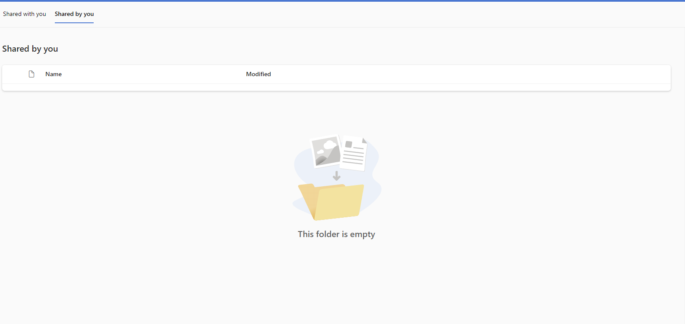

# Remove all Shared Items from your OneDrive account


So I realized I've shared a bunch of OneDrive links with people over the years, and since I was lazy I always created them with 'Anyone with this link can view', this was great at the time, especially with less technically inclined family members. But now I have a bunch of wild links to my personal stuff (some *really* personal stuff).

You can see all the files you've shared here:

https://onedrive.live.com/?id=root&qt=sharedbyme

Thought I can one click remove them via the UI, but apparently to remove them you need to **individually** do the following 5 steps


This is dumb and impractical.

I thought GraphAPI would come to the rescue, and give me a single endpoint I can hit with node.js and get it over with. 
I thought wrong. 

The only API available is for "Shared With Me":

https://learn.microsoft.com/en-us/onedrive/developer/rest-api/api/drive_sharedwithme?view=odsp-graph-online

As per comment on issue on github: 

> they don't have a public API to support 'Shared By Me' scenario, and also don't have plan to support it in recent future
>
> https://github.com/microsoftgraph/microsoft-graph-docs/issues/14945

So I busted out the network tab in dev tools, and realized the web UI makes a call to

https://api.onedrive.com/v1.0/drive/shared?%24select=*%2CfileSystemInfo%2Cfolder%2Creactions%2Cbundle%2CwebDavUrl

And realized this API existed for the 'legacy' OneDrive API, for some reason there's a doc page on github but not on MSDN site:

https://github.com/OneDrive/onedrive-api-docs/blob/live/docs/rest-api/api/drive_sharedbyme.md

But to remove the permissions, I also need to have the permission ID for each shared item

https://learn.microsoft.com/en-us/onedrive/developer/rest-api/api/permission_delete?view=odsp-graph-online

## My journey:

1. To hit the OneDrive API, I need to grab a token. I could steal it from the web app, but I'd like to do it properly. So first I register an app in Azure

   

2. Then use the client ID and scope to get OneDrive API token, have it redirect to my personal URL

   

3. Get list of shared items from OneDrive API with Postman 

   

   Saved these into a json file called `sharedItems.json`

4. Since the delete API is under Graph, I need to get a graph token (used [Graph explorer tool](https://learn.microsoft.com/en-us/onedrive/developer/rest-api/api/permission_delete?view=odsp-graph-online) because I am lazy)
   
   

5. Then wrote this script to get a list of permission IDs:

   ```node
   const fs = require("fs");

   let sharedItems = JSON.parse(fs.readFileSync("sharedItems.json"));

   let sharedItemIds = sharedItems.value.map((item) => item.id);

   let token = "<your graph token here>";

   let process = async (id) => {
      let res = await fetch(
         `https://graph.microsoft.com/v1.0/me/drive/items/${id}/permissions`,
         {
            headers: {
            Authorization: "Bearer " + token,
            // 'Content-Type': 'application/x-www-form-urlencoded',
            },
         }
      );

      let resData = await res.json();
      if (!resData) {
         return;
      }

      return {
         id: id,
         permissionIds: resData?.value.map((permValue) => permValue.id),
      };
   };

   let promises = sharedItemIds.map(process);

   Promise.all(promises).then((data) => {
      fs.writeFileSync(
         "sharedItemsWithPermissionIds.json",
         JSON.stringify(data, null, 2)
      );
   });
   ```

6. Then wrote this script to actually do the delete. Could've done it in the same file but I wanted to make sure I didn't majorly screw up anything

   ```node
   const fs = require("fs");

   let sharedItemsWithPermissionIds = JSON.parse(fs.readFileSync("sharedItemsWithPermissionIds.json"));

   let token = "<your graph token here>";

   let process = async (item) => {
      if (!item.permissionIds || item.permissionIds.length < 1) {
         return;
      }
      for (const permissionId of item.permissionIds) {
         let res = await fetch(
            `https://graph.microsoft.com/v1.0/me/drive/items/${item.id}/permissions/${permissionId}`,
            {
            headers: {
               Authorization: "Bearer " + token,
            },
            method: "DELETE",
            }
         );
         console.log(res.ok);
      }
   };

   let promises = sharedItemsWithPermissionIds.map(process);

   Promise.all(promises);
   ```

Voila!




***Made sure to cut off the tokens, but please do let me know if I missed anything :)***